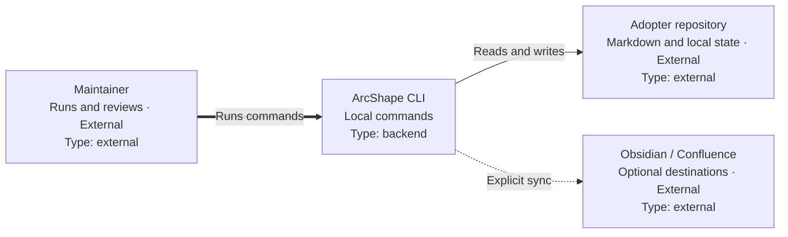

```mermaid
%% Generated by ArcShape diagram bundle {"source":"d114883cd6a9f21fde8f4de45a0bfe0de615cf1cd7f57ec3dd78741a5935ba66","content":"f9cd8d4113149c637b41d02154a62428e836c4e990d2266665e3c8dd726fc90a"}
flowchart LR
  accTitle: ArcShape system context
  %% Semantic projection of native architecture; native layout and effects are not Mermaid notation.
  n0["Maintainer
Runs and reviews · External
Type: external"]
  n1["ArcShape CLI
Local commands
Type: backend"]
  n2["Adopter repository
Markdown and local state · External
Type: external"]
  n3["Obsidian / Confluence
Optional destinations · External
Type: external"]
  n0 ==>|"Runs commands"| n1
  n1 -->|"Reads and writes"| n2
  n1 -.->|"Explicit sync"| n3
```
