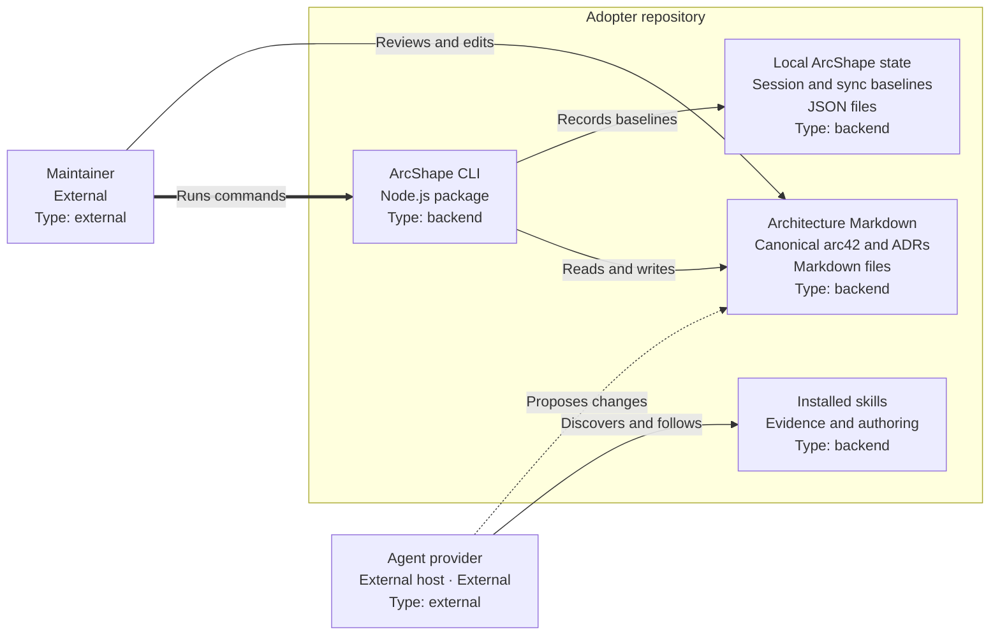

```mermaid
%% Generated by ArcShape diagram bundle {"source":"26f36dbc5cd5abd7474e8039b561e42ff9ca135c38d73dbc2cea84bf9a279472","content":"d38f89d914f14354d1a4637ec2450eeac69d68d0ac15c5bcdea65f3f97eef4bf"}
flowchart LR
  accTitle: ArcShape containers in a project repository
  %% Semantic projection of native architecture; native layout and effects are not Mermaid notation.
  subgraph g0["Adopter repository"]
  n2["ArcShape CLI
Node.js package
Type: backend"]
  n3["Architecture Markdown
Canonical arc42 and ADRs
Markdown files
Type: backend"]
  n4["Installed skills
Evidence and authoring
Type: backend"]
  n5["Local ArcShape state
Session and sync baselines
JSON files
Type: backend"]
  end
  n0["Maintainer
External
Type: external"]
  n1["Agent provider
External host · External
Type: external"]
  n0 ==>|"Runs commands"| n2
  n0 -->|"Reviews and edits"| n3
  n1 -->|"Discovers and follows"| n4
  n1 -.->|"Proposes changes"| n3
  n2 -->|"Reads and writes"| n3
  n2 -->|"Records baselines"| n5
```
