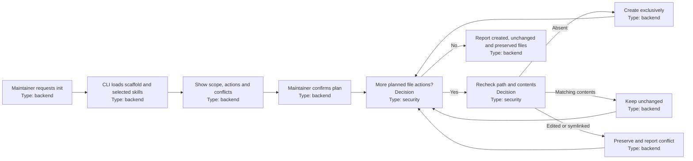

```mermaid
%% Generated by ArcShape diagram bundle {"source":"bf83689be0293faf1546cfcf30fdd155b693557c00e9210884252e21bbd5214e","content":"1a6bbc7c52ce46e063f870947e7f27dd8c3c0db528d29728f5f6ba8a40ea82a9"}
flowchart LR
  accTitle: Safe ArcShape initialization flow
  %% Semantic projection of native architecture; native layout and effects are not Mermaid notation.
  n0["Maintainer requests init
Type: backend"]
  n1["CLI loads scaffold and selected skills
Type: backend"]
  n2["Show scope, actions and conflicts
Type: backend"]
  n3["Maintainer confirms plan
Type: backend"]
  n4["More planned file actions?
Decision
Type: security"]
  n5["Recheck path and contents
Decision
Type: security"]
  n6["Create exclusively
Type: backend"]
  n7["Keep unchanged
Type: backend"]
  n8["Preserve and report conflict
Type: backend"]
  n9["Report created, unchanged and preserved files
Type: backend"]
  n0 --> n1
  n1 --> n2
  n2 --> n3
  n3 --> n4
  n4 -->|"Yes"| n5
  n5 -->|"Absent"| n6
  n5 -->|"Matching contents"| n7
  n5 -->|"Edited or symlinked"| n8
  n6 --> n4
  n7 --> n4
  n8 --> n4
  n4 -->|"No"| n9
```
