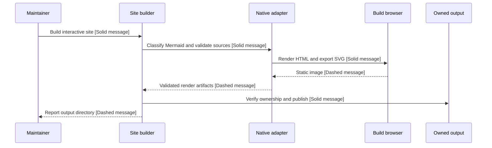

```mermaid
%% Generated by ArcShape diagram bundle {"source":"ffa2ce382f59af6758aa757722f065d97e915faa277d4b001a0430878eba9706","content":"8a3ca2d003335ac55f45b68e043b8ecec66d78692fe5cc377426c946c8174285"}
sequenceDiagram
  accTitle: Build native architecture diagrams
  participant p0 as Maintainer
  participant p1 as Site builder
  participant p2 as Native adapter
  participant p3 as Build browser
  participant p4 as Owned output
  p0->>p1: Build interactive site [Solid message]
  p1->>p2: Classify Mermaid and validate sources [Solid message]
  p2->>p3: Render HTML and export SVG [Solid message]
  p3-->>p2: Static image [Dashed message]
  p2-->>p1: Validated render artifacts [Dashed message]
  p1->>p4: Verify ownership and publish [Solid message]
  p1-->>p0: Report output directory [Dashed message]
```
