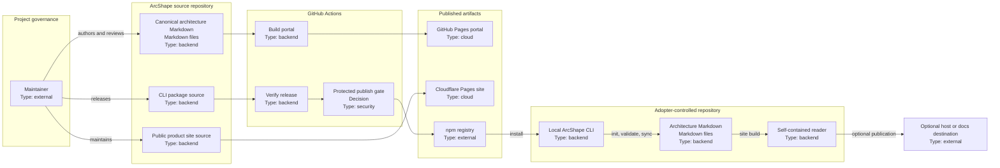

```mermaid
%% Generated by ArcShape diagram bundle {"source":"7dc098235072ed50cbf116177a895c66c67fe8a876db455f7191e85ccc9bbbd2","content":"9d71d218ab033fc02cd40603f00fc155fc96ae2278d3cbd2cd8439fd01036c4e"}
flowchart LR
  accTitle: ArcShape publication and adopter deployment boundaries
  %% Semantic projection of native architecture; native layout and effects are not Mermaid notation.
  subgraph g0["Project governance"]
  n0["Maintainer
Type: external"]
  end
  subgraph g1["ArcShape source repository"]
  n1["Canonical architecture Markdown
Markdown files
Type: backend"]
  n2["Public product site source
Type: backend"]
  n3["CLI package source
Type: backend"]
  end
  subgraph g2["GitHub Actions"]
  n4["Build portal
Type: backend"]
  n5["Verify release
Type: backend"]
  n6["Protected publish gate
Decision
Type: security"]
  end
  subgraph g3["Published artifacts"]
  n7["GitHub Pages portal
Type: cloud"]
  n8["Cloudflare Pages site
Type: cloud"]
  n9["npm registry
Type: external"]
  end
  subgraph g4["Adopter-controlled repository"]
  n10["Local ArcShape CLI
Type: backend"]
  n11["Architecture Markdown
Markdown files
Type: backend"]
  n12["Self-contained reader
Type: backend"]
  end
  n13["Optional host or docs destination
Type: external"]
  n0 -->|"authors and reviews"| n1
  n0 -->|"maintains"| n2
  n0 -->|"releases"| n3
  n1 --> n4
  n4 --> n7
  n2 --> n8
  n3 --> n5
  n5 --> n6
  n6 --> n9
  n9 -->|"install"| n10
  n10 -->|"init, validate, sync"| n11
  n11 -->|"site build"| n12
  n12 -->|"optional publication"| n13
```
