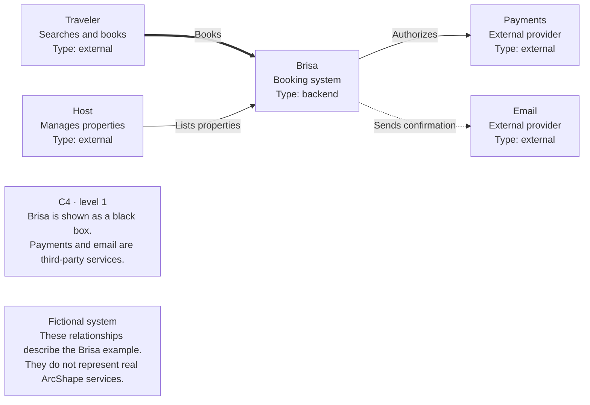

```mermaid
%% Generated by ArcShape diagram bundle {"source":"b9b278babfa93302920892571bbdf96ccea186a523586263e8dc05ad82079a83","content":"0816d12bf5bf0fc7b1bb00d3bebfe01afc1b9447b842cfab3d25b728b3210c58"}
flowchart LR
  accTitle: Brisa · system context
  %% Semantic projection of native architecture; native layout and effects are not Mermaid notation.
  n0["Traveler
Searches and books
Type: external"]
  n1["Brisa
Booking system
Type: backend"]
  n2["Payments
External provider
Type: external"]
  n3["Host
Manages properties
Type: external"]
  n4["Email
External provider
Type: external"]
  n0 ==>|"Books"| n1
  n1 -->|"Authorizes"| n2
  n3 -->|"Lists properties"| n1
  n1 -.->|"Sends confirmation"| n4
  note0["C4 · level 1
Brisa is shown as a black box.
Payments and email are third-party services."]
  note1["Fictional system
These relationships describe the Brisa example.
They do not represent real ArcShape services."]
```
