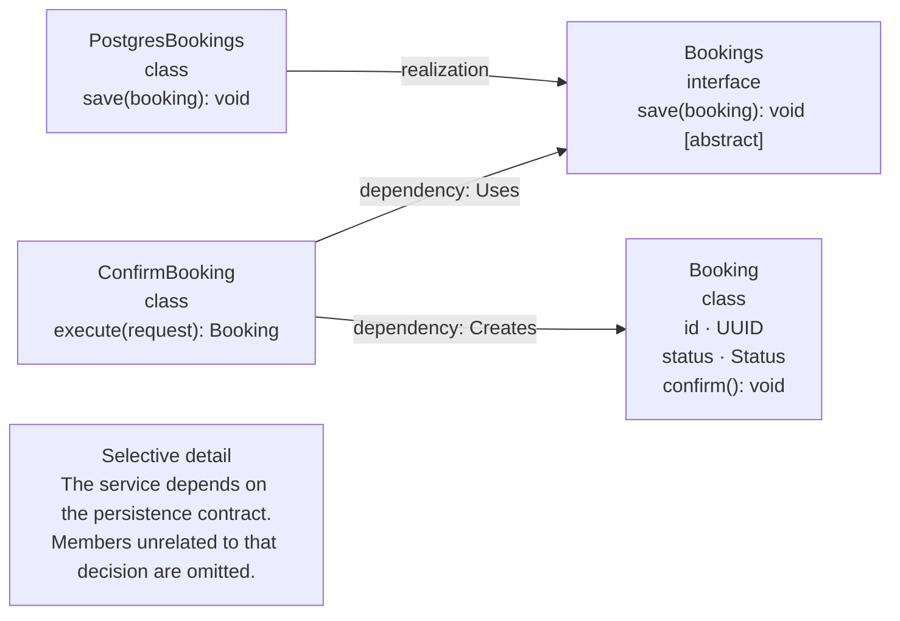

```mermaid
%% Generated by ArcShape diagram bundle {"source":"80bdc80b06ce1d4d64258078fd97490c8dd9f5dbdc0261b714eb91f823b7c466","content":"afed079530f3af7a9defa315d9429bdbc929bacd809f556d3bf88e7cfbd334b0"}
flowchart LR
  accTitle: Persistence contract
  %% Semantic projection of native class; native layout and effects are not Mermaid notation.
  n0["ConfirmBooking
class
execute(request): Booking"]
  n1["Bookings
interface
save(booking): void [abstract]"]
  n2["PostgresBookings
class
save(booking): void"]
  n3["Booking
class
id · UUID
status · Status
confirm(): void"]
  n0 -->|"dependency: Uses"| n1
  n2 -->|"realization"| n1
  n0 -->|"dependency: Creates"| n3
  note0["Selective detail
The service depends on the persistence contract.
Members unrelated to that decision are omitted."]
```
