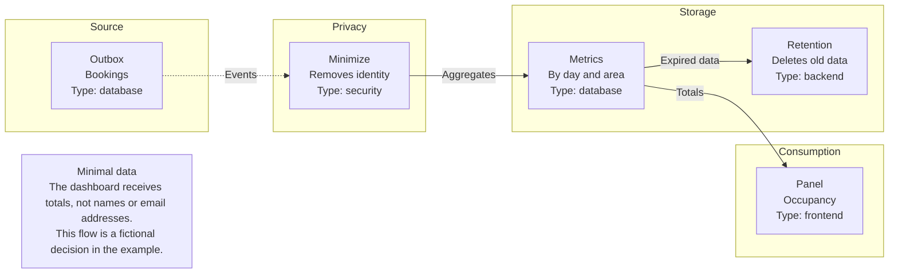

```mermaid
%% Generated by ArcShape diagram bundle {"source":"ab3b28ae2725602f5e11938771ba9ba33b58491f215f4232d179f78bcd07f786","content":"a27db6634c606db6508369949325a13bb8171a9ca78c28dfd60ba5b86dbccbd7"}
flowchart LR
  accTitle: From bookings to statistics
  %% Semantic projection of native dataflow; native layout and effects are not Mermaid notation.
  subgraph g0["Source"]
  n0["Outbox
Bookings
Type: database"]
  end
  subgraph g1["Privacy"]
  n1["Minimize
Removes identity
Type: security"]
  end
  subgraph g2["Storage"]
  n2["Metrics
By day and area
Type: database"]
  n4["Retention
Deletes old data
Type: backend"]
  end
  subgraph g3["Consumption"]
  n3["Panel
Occupancy
Type: frontend"]
  end
  n0 -.->|"Events"| n1
  n1 -->|"Aggregates"| n2
  n2 -->|"Totals"| n3
  n2 -->|"Expired data"| n4
  note0["Minimal data
The dashboard receives totals, not names or email addresses.
This flow is a fictional decision in the example."]
```
