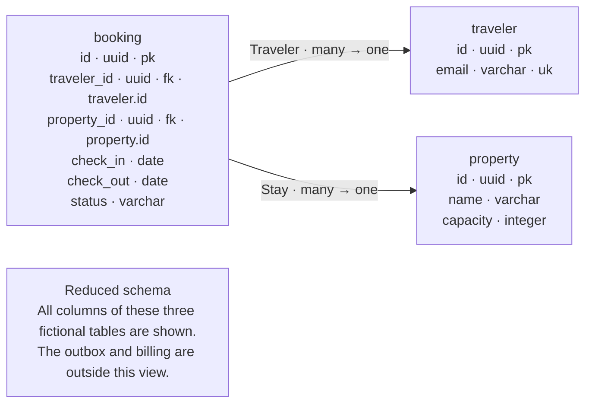

```mermaid
%% Generated by ArcShape diagram bundle {"source":"065e2fd69f6be67337e80e1e9fd6403de2dd83b93386b852a74bceb8c284418d","content":"a26ba5ed3f606d7bdf5a5f6fc057212a5463ec54633bf1c8ea26763111157794"}
flowchart LR
  accTitle: Brisa relational model
  %% Semantic projection of native erd; native layout and effects are not Mermaid notation.
  n0["traveler
id · uuid · pk
email · varchar · uk"]
  n1["booking
id · uuid · pk
traveler_id · uuid · fk · traveler.id
property_id · uuid · fk · property.id
check_in · date
check_out · date
status · varchar"]
  n2["property
id · uuid · pk
name · varchar
capacity · integer"]
  n1 -->|"Traveler · many → one"| n0
  n1 -->|"Stay · many → one"| n2
  note0["Reduced schema
All columns of these three fictional tables are shown.
The outbox and billing are outside this view."]
```
