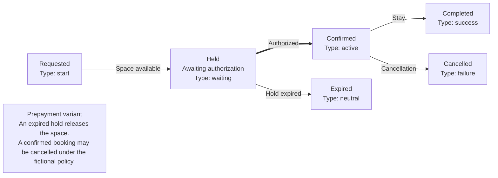

```mermaid
%% Generated by ArcShape diagram bundle {"source":"8b7b4045ff4196d319fdbbcdc71b51a52b84354c9de2c16fef272e39e7a4cec8","content":"50414dd49b52482ab8b4f93901143735875c3414f5a8b5afb58294d264aa3a28"}
flowchart LR
  accTitle: Booking lifecycle
  %% Semantic projection of native lifecycle; native layout and effects are not Mermaid notation.
  n0["Requested
Type: start"]
  n1["Held
Awaiting authorization
Type: waiting"]
  n2["Confirmed
Type: active"]
  n3["Completed
Type: success"]
  n4["Expired
Type: neutral"]
  n5["Cancelled
Type: failure"]
  n0 -->|"Space available"| n1
  n1 ==>|"Authorized"| n2
  n2 -->|"Stay"| n3
  n1 -->|"Hold expired"| n4
  n2 -->|"Cancellation"| n5
  note0["Prepayment variant
An expired hold releases the space.
A confirmed booking may be cancelled under the fictional policy."]
```
