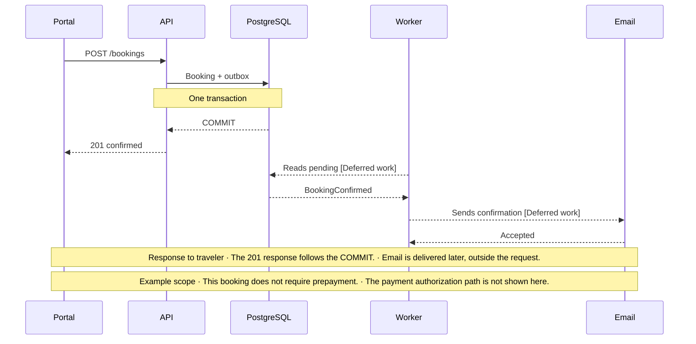

```mermaid
%% Generated by ArcShape diagram bundle {"source":"ae7d2ad1273a91590cc8fa6941c97eb3855a5c9585862d72389cec9f9d06fdc8","content":"a2907e3528fd5656e3a598e21ff4ee2d96894b7ef5ca91f41f0a4f58a98e38ed"}
sequenceDiagram
  accTitle: Confirm a booking
  participant p0 as Portal
  participant p1 as API
  participant p2 as PostgreSQL
  participant p3 as Worker
  participant p4 as Email
  p0->>p1: POST /bookings
  p1->>p2: Booking + outbox
  Note over p1,p2: One transaction
  p2-->>p1: COMMIT
  p1-->>p0: 201 confirmed
  p3-->>p2: Reads pending [Deferred work]
  p2-->>p3: BookingConfirmed
  p3-->>p4: Sends confirmation [Deferred work]
  p4-->>p3: Accepted
  Note over p0,p4: Response to traveler · The 201 response follows the COMMIT. · Email is delivered later, outside the request.
  Note over p0,p4: Example scope · This booking does not require prepayment. · The payment authorization path is not shown here.
```
