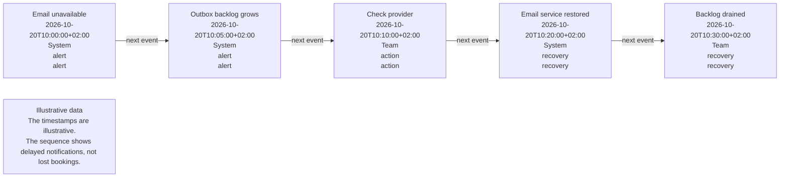

```mermaid
%% Generated by ArcShape diagram bundle {"source":"d6e1a8d8078353ac88673d6a3a640b8db566da4bd812b25a3a6eb5b0f5986ce4","content":"e06ef8239288bbeeddc258377d9fc607e07cf8251a566fc4c5a7d5f6b1832fe4"}
flowchart LR
  accTitle: Fictional notification incident
  %% Semantic projection of native timeline; native layout and effects are not Mermaid notation.
  n0["Email unavailable
2026-10-20T10:00:00+02:00
System
alert
alert"]
  n1["Outbox backlog grows
2026-10-20T10:05:00+02:00
System
alert
alert"]
  n2["Check provider
2026-10-20T10:10:00+02:00
Team
action
action"]
  n3["Email service restored
2026-10-20T10:20:00+02:00
System
recovery
recovery"]
  n4["Backlog drained
2026-10-20T10:30:00+02:00
Team
recovery
recovery"]
  n0 -->|"next event"| n1
  n1 -->|"next event"| n2
  n2 -->|"next event"| n3
  n3 -->|"next event"| n4
  note0["Illustrative data
The timestamps are illustrative.
The sequence shows delayed notifications, not lost bookings."]
```
