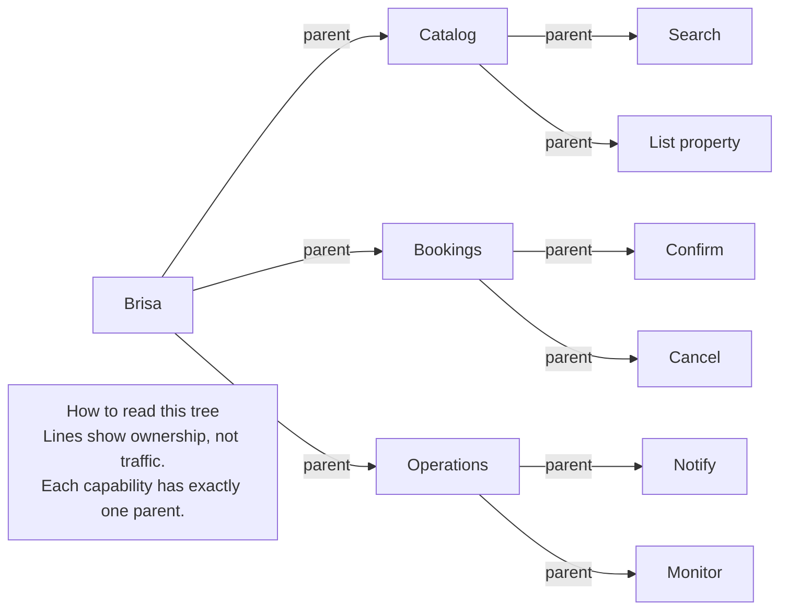

```mermaid
%% Generated by ArcShape diagram bundle {"source":"5eeb2127d0797544f3787b82035bf7048319b7685ff72e7ce6f8049eabf9e013","content":"d3b3d741bf452b0393af0493ee0872d80dfd654c233dfcf46504c47dea4dd250"}
flowchart LR
  accTitle: Capability decomposition
  %% Semantic projection of native tree; native layout and effects are not Mermaid notation.
  n0["Brisa"]
  n1["Catalog"]
  n2["Bookings"]
  n3["Operations"]
  n4["Search"]
  n5["List property"]
  n6["Confirm"]
  n7["Cancel"]
  n8["Notify"]
  n9["Monitor"]
  n0 -->|"parent"| n1
  n0 -->|"parent"| n2
  n0 -->|"parent"| n3
  n1 -->|"parent"| n4
  n1 -->|"parent"| n5
  n2 -->|"parent"| n6
  n2 -->|"parent"| n7
  n3 -->|"parent"| n8
  n3 -->|"parent"| n9
  note0["How to read this tree
Lines show ownership, not traffic.
Each capability has exactly one parent."]
```
