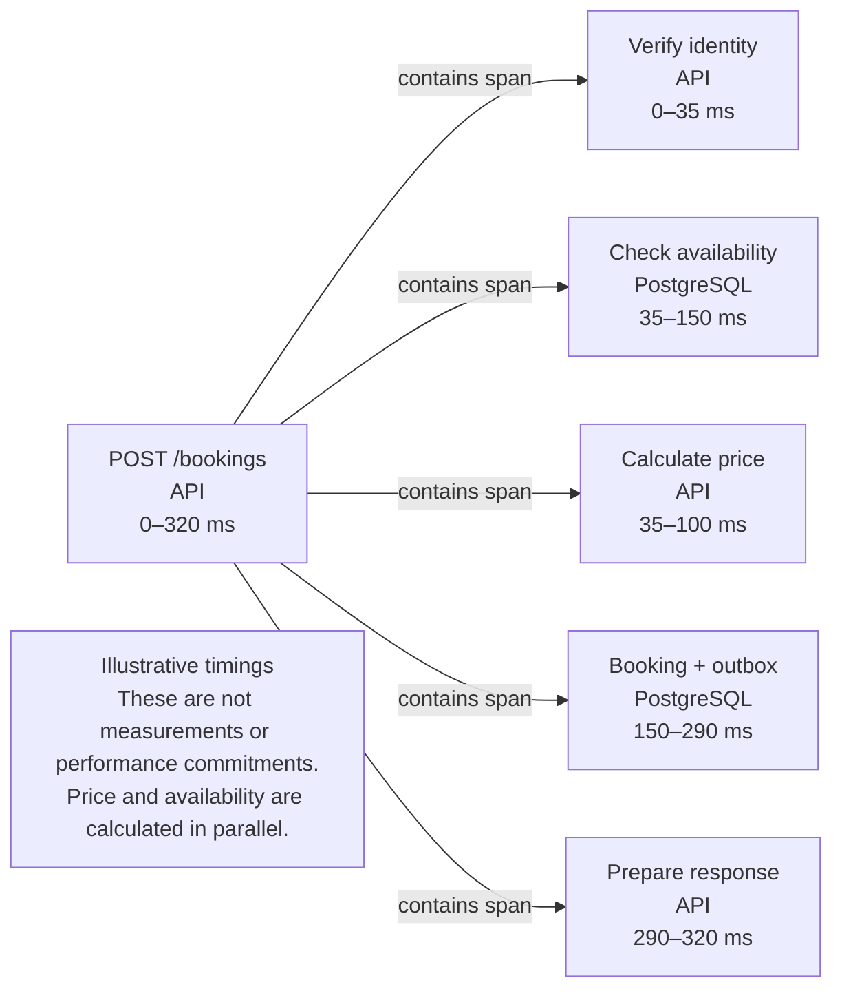

```mermaid
%% Generated by ArcShape diagram bundle {"source":"f64f697eeef2e933cd7ea352223a8644619a057c4a0f303e49ee2ef644d91e7b","content":"cea523d1f0b295b38adb24bf837919ea3ad000c72f40b8dadb25ed43eeb4eef5"}
flowchart LR
  accTitle: Request time budget
  %% Semantic projection of native waterfall; native layout and effects are not Mermaid notation.
  n0["POST /bookings
API
0–320 ms"]
  n1["Verify identity
API
0–35 ms"]
  n2["Check availability
PostgreSQL
35–150 ms"]
  n3["Calculate price
API
35–100 ms"]
  n4["Booking + outbox
PostgreSQL
150–290 ms"]
  n5["Prepare response
API
290–320 ms"]
  n0 -->|"contains span"| n1
  n0 -->|"contains span"| n2
  n0 -->|"contains span"| n3
  n0 -->|"contains span"| n4
  n0 -->|"contains span"| n5
  note0["Illustrative timings
These are not measurements or performance commitments.
Price and availability are calculated in parallel."]
```
