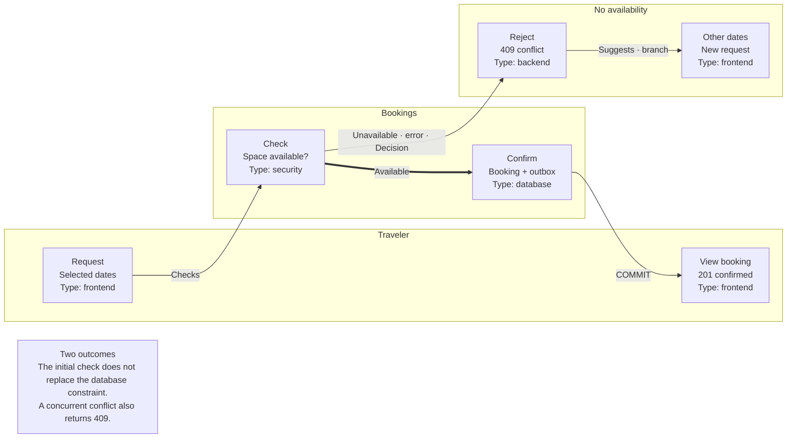

```mermaid
%% Generated by ArcShape diagram bundle {"source":"a95b3908a5b35887f69007579ffa399cbe530ec99dff74f1d2ee42e4ef8ac0a0","content":"5a0af13bf95264453f53e3768275c26a420064deccfe85120f56e2336b3b44c2"}
flowchart LR
  accTitle: From request to confirmation
  %% Semantic projection of native workflow; native layout and effects are not Mermaid notation.
  subgraph g0["Traveler"]
  n0["Request
Selected dates
Type: frontend"]
  n3["View booking
201 confirmed
Type: frontend"]
  end
  subgraph g1["Bookings"]
  n1["Check
Space available?
Type: security"]
  n2["Confirm
Booking + outbox
Type: database"]
  end
  subgraph g2["No availability"]
  n4["Reject
409 conflict
Type: backend"]
  n5["Other dates
New request
Type: frontend"]
  end
  n0 -->|"Checks"| n1
  n1 ==>|"Available"| n2
  n2 -->|"COMMIT"| n3
  n1 -->|"Unavailable · error · Decision"| n4
  n4 -->|"Suggests · branch"| n5
  note0["Two outcomes
The initial check does not replace the database constraint.
A concurrent conflict also returns 409."]
```
